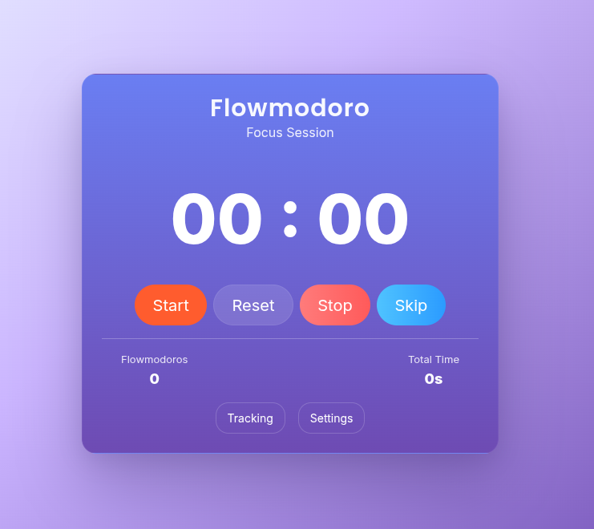
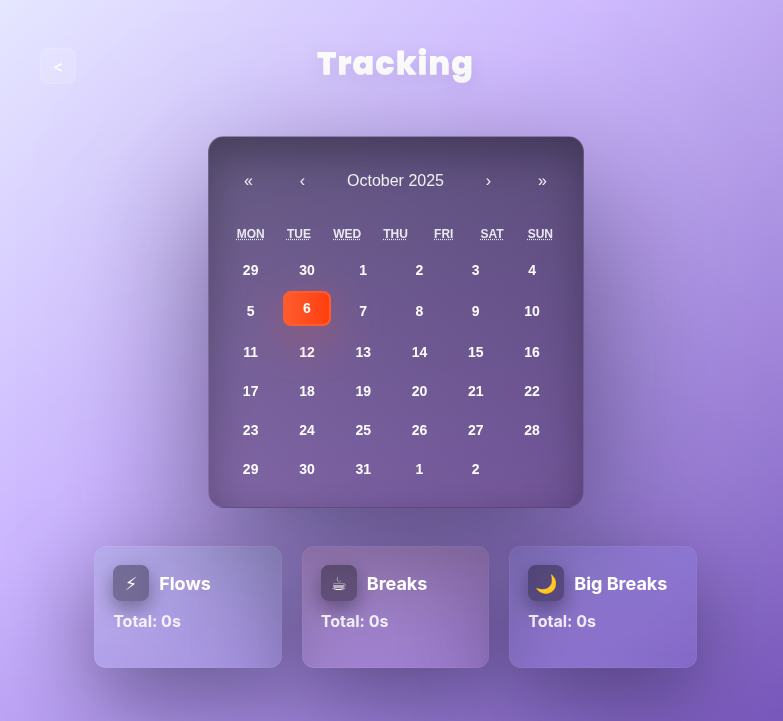

# Flowmodoro

**Built with**: AI for syntax | Human for logic | Learning clean, scalable code  
All repos public to show my evolution as a developer 📈

---



**Flowmodoro** is a simple React + Bootstrap single-page app to track open-ended "flow" sessions with integrated breaks and a calendar view.
It provides a timer, settings, local storage persistence, and a Docker Compose setup with frontend + backend.

---

### Features

* Count-up timer (Start / Pause / Reset). Sessions are recorded as flows.
* Stop / Skip flows; short/long breaks are handled inline and recorded.
* Settings modal (frosted purple) with configurable durations and rhythm.
* Calendar view with daily aggregates and session lists.
* Docker setup:

  * Frontend (nginx)
  * Backend (Express + SQLite) with persistent volume

---

### How to Run

1. Build and run with Docker Compose:

```sh
docker compose up --build -d
```

This starts two services:

* **flowmodoro-frontend** — React app served via nginx at [http://127.0.0.1:5174](http://127.0.0.1:5174)
* **flowmodoro-backend** — Express API + SQLite (internal port 3001)

The backend stores sessions in a Docker volume `flowmodoro-data`, which persists across restarts.

To remove stored data:

```sh
docker compose down
docker volume rm flowmodoro_flowmodoro-data
```

---

### Development

Install dependencies and run dev server:

```sh
npm install
npm run dev
```

---

### Screenshots

Main view:


Tracking view:


---

## 📄 License

This project is licensed under the MIT License - see the [LICENSE](LICENSE) file for details.
